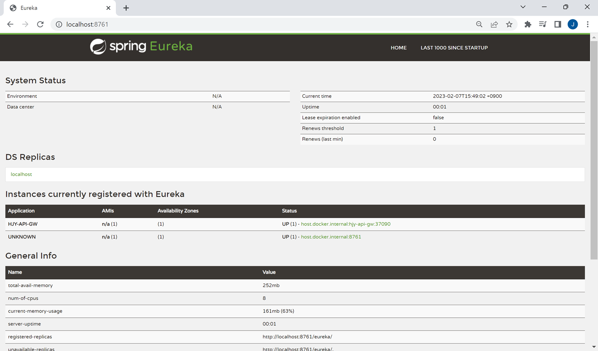

## Eureka Service Study

### 구성
- server-photoapp
- spring-api-gateway(API Gateway)
- eureka-server

###### Spring Api GW 
- implementation("org.springframework.cloud:spring-cloud-starter-netflix-eureka-client")

###### Eureka Server
- implementation("org.springframework.cloud:spring-cloud-starter-netflix-eureka-server")
- eureka server를 통해 api gw에 요청 전달
- eureka 관리페이지 접속하여 api server 관리 가능
